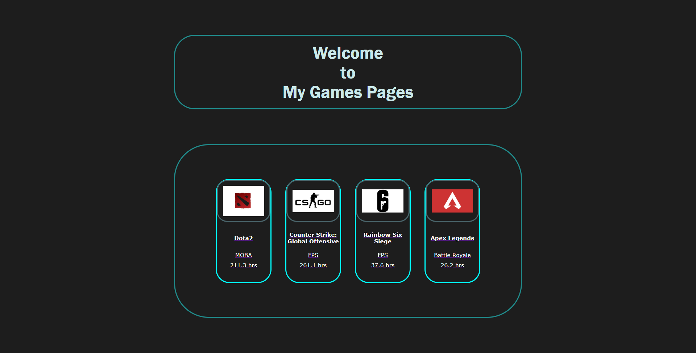

## Personal Website

by Frenrico Chang<br>
class : PPTI 12<br>
absent: 13<br>
NIM   : 2502041174<br>

## Images
```sh
Berikut merupakan hasil screenshot dari personal website yang sudah dibuat:
```




## Usage
```sh
php artisan serve
```
## DONE!

